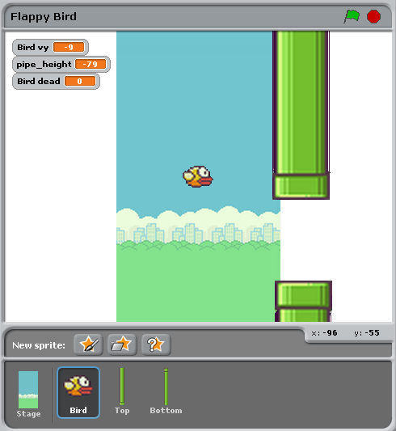

從Scratch到Pygame Zero
=======================

這份教學將會比較用Scratch和Pygame Zero編寫的Flappy Bird遊戲。Scratch和Pygame Zero
的相似度是非常高的

提示: `Pygame Zero版本的Flappy Bird`__ 包含在了Pygame Zero的代碼庫中.

.. __: https://github.com/lordmauve/pgzero/blob/master/examples/flappybird/flappybird.py

你也可以從代碼庫中下載`Scratch` 版本 `Scratch version`__ 的Flappy Bird遊戲.

.. __: https://github.com/lordmauve/pgzero/raw/master/examples/flappybird/Flappy Bird.sb

Pygame Zero版本的遊戲包含了積分邏輯，但是為了更清晰對比二者實現，所以在這份教學裡忽略了積分。

下面的Python腳本為講解的更清晰重寫了。

舞台
---------

在Scratch舞台上的內容弄是這樣的：

除了舞台背景之外，還有三個對象，小鳥，上方管道和下方管道

對應的pygame Zero代碼則是把這三個角色都設置為 ``Actors`` (中文是演員？角色？差不多意思吧)::

   bird = Actor('bird1', (75, 200))
   pipe_top = Actor('top', anchor=('left', 'bottom'))
   pipe_bottom = Actor('bottom', anchor=('left', 'top'))

在Pygame Zero中我們必須確保我們繪製了這3個對象，原則上這使得繪製場景有更大的可伸縮性
和自由度::

   def draw():
       screen.blit('background', (0, 0))
       pipe_top.draw()
       pipe_bottom.draw()
       bird.draw()

管道移動
-------------

管道的移動速度是恆定不變的，與小鳥沒有關係。當管道會不停的從螢幕的左邊移動到右邊，並且
在數值方向的位置是隨機變化的。

在Scratch中我們可以透過給頂部和底部的管道添加兩個腳本來實現管道的移動。

.. image:: _static/scratch/flappybird-top-start.png

.. image:: _static/scratch/flappybird-bottom-start.png

我們來概括的講下這些腳本的作用：

* 當管道在螢幕左邊即將出現的時候,條件 `x position < -240` 成立,並且會導致管道位置重設
* 變數 `pipe_height` 用來改變管道在數值方向的位置.上下管道之間的間隔應該是不變的,所以
  不能讓兩個管道的位置都是隨機的,所以我們只在一個腳本設置了讓pipe_height隨機的邏輯.
* 腳本 ``set y position to pipe height +/- 230`` 讓頂部的管道在 ``pipe_height`` 上方
  底部的管道在 ``pipe_height`` 下方.

在Pygame Zero中代碼就簡單多了.我們可以定義一個函數不停的更新兩個管道.當然我把更新管道
的過程分成了兩部分,這樣管道重設的過程就更加清晰了::

   import random

   WIDTH = 400
   HEIGHT = 708
   GAP = 130
   SPEED = 3

   def reset_pipes():
       pipe_gap_y = random.randint(200, HEIGHT - 200)
       pipe_top.pos = (WIDTH, pipe_gap_y - GAP // 2)
       pipe_bottom.pos = (WIDTH, pipe_gap_y + GAP // 2)

   def update_pipes():
       pipe_top.left -= SPEED
       pipe_bottom.left -= SPEED
       if pipe_top.right < 0:
           reset_pipes()

與Scratch不同的是,我可以把需要重用的值定義為"常量", 用大寫字幕表示. 當我需要調整遊戲
的時候,我只需要修改一次值就好了.比如在上面的例子中,當我需要加大間隔或者減小間隔的時候
我只需要簡單的修改 ``GAP`` 的值就好了.

與Scratch代碼最大的不同在於, Python代碼中沒有 ``forever`` 循環. 這是Scratch和大多數
文本程式語言的區別: 你必須透過每次更新一小步動畫的方式來更新遊戲並且返回. 返回讓pygame
Zero有機會處理處理輸入或者重新繪製螢幕.不斷的循環就會形成遊戲了,所以每一個循環必須很快
完成.

當你需要更新遊戲一點點內容的時候,Pygame Zero會調用 ``update()`` 函數,然後我們需要調
用 ``update_walls`` ::

   def update():
      update_walls()

小鳥
--------

上面介紹的如何把Scratch邏輯轉換為Python代碼的模式同樣適用於小腳的邏輯.讓我們先來看
一下小鳥的代碼.

更新小鳥相關的代碼被整合到了 ``update_bird`` 方法. 首先這段代碼包含了讓小鳥飛翔的邏輯::

   GRAVITY = 0.3

   # 初始化小鳥的狀態
   bird.dead = False
   bird.vy = 0

   def update_bird():
       uy = bird.vy
       bird.vy += GRAVITY
       bird.y += bird.vy
       bird.x = 75

這是一個很簡單的重力公式:

* GRAVITY 指的的是 **重力加速度** 常數
* acceleration 用來改變 **速度**
* 速度用來改變小鳥的 **位置**

我們需要建立一個 ``bird.vy`` 變數, 表示小鳥在 ``y`` 方向的速度.這是我們新定義的一個
變數,不是Pygame Zero提供給我們的

* 重力是向下的加速度常量: ``GRAVITY`` 大於0
* 加速度用來改變速度: 把 ``GRAVITY`` 加到 ``bird.vy`` 也就是小鳥豎直方向的速速
* 速度概念位置: 把 ``bird.vy`` 加到 ``bird.y`` 上 

注意!小鳥水平方向的位置是始終不變的,整個遊戲中小鳥的 ``x`` 坐標始終是 75. 我們通過
讓管道移動來模擬小鳥的運動.看起來就像是我們我們又一個跟著小鳥移動的鏡頭.因此我們在
遊戲中並不需要 ``vx`` 變數.

The next section makes the bird flap its wings::
然後我們讓小鳥可以拍打自己的翅膀::

       if not bird.dead:
           if bird.vy < -3:
               bird.image = 'bird2'
           else:
               bird.image = 'bird1'

檢查小鳥是否向上或者向下移動. 如果小鳥快速的向上移動我們展示 ``bird2`` 圖像,反之展示
``bird1`` 圖像. -3是透過不斷試錯得出的經驗值,這樣遊戲看起來會更加真實.

接下來我們要檢測小鳥有沒有撞牆::

       if bird.colliderect(pipe_top) or bird.colliderect(pipe_bottom):
           bird.dead = True
           bird.image = 'birddead'

如果撞牆了把變數 ``bird.dead`` 值設置為 ``True`` .這是一個 **布爾值** 表示非假即真.
我們可以方便的用布爾變數來檢測小鳥是否還活著,如果小鳥掛了,我們就不需要處理玩家的輸入了. 

最後我們檢測一下小鳥有沒有觸地或者觸頂, 如果是的話重設小鳥的狀態和屬性::

       if not 0 < bird.y < 720:
           bird.y = 200
           bird.dead = False
           bird.vy = 0
           reset_pipes()

重設小鳥的時候為什麼要調用 ``reset_pipes()`` 呢? 是因為我把我管道的代碼定義成一個
單獨的函數,我可以在我需要重設遊戲中的牆的時候調用這個函數.這樣小鳥回到初始位置的是
玩家有反應的時間,這樣才是一個好的遊戲.

Again, this needs to be called every frame, so we add it to ``update()``::
再次重申,以上過程每一幀都要調用,因此我們把這些操作放到 ``update_date()`` 函數::

   def update():
      update_walls()
      update_bird()

最後我們在遊戲邏輯裡必須響應玩家控制.當我們單擊鍵盤的時候,小鳥向上飛. 當你按了鍵盤
上的某一個鍵,Pygame Zero會調用 ``on_key_down`` 函數::

   FLAP_VELOCITY = -6.5

   def on_key_down():
       if not bird.dead:
           bird.vy = FLAP_VELOCITY

在這裡,如果小鳥沒掛的話,我們設置小鳥的 ``vy`` 縱向速度為一個複製:在Pygame Zero裡
這意味著小鳥向上飛.

無論是Scratch還是Python代碼,你都能夠找到許多並行的代碼:

.. image:: _static/scratch/flappybird-bird-start.png

Scratch和Pygame Zero最大的不同在於:

* 在Pygame Zero中你不能一直循環 - 只更新每一幀並且返回
* 坐標系不同.Pygame Zero,螢幕的左上角是原點 ``x = 0, y = 0``, ``x`` 跟Scratch一樣是
  從左向右的,但是 ``y`` 軸指向螢幕下方! 這也是 ``GRAVITY`` 是正數而 ``FLAP_VELOCITY`` 
  是負數 了.
* ``bird.dead`` 是一個布爾值, 所以我們寫 ``if not bird.dead`` 而不是像Scratch一樣
  寫 ``dead = 0``.

總結
-------

Many of the concepts available in Scratch can be translated directly into
Pygame Zero.
許多Scratch種的概念可以直接遷移到Pygame Zero中.

下面是一些對比:

+----------------------------+--------------------------------------------+
| In Scratch                 | In Pygame Zero                             |
+============================+============================================+
| ``change y by 1`` (up)     | ``bird.y -= 1``                            |
+----------------------------+--------------------------------------------+
| ``change y by -1`` (down)  | ``bird.y += 1``                            |
+----------------------------+--------------------------------------------+
| ``set costume to <name>``  | ``bird.image = 'name'``                    |
+----------------------------+--------------------------------------------+
| ``if dead = 0``            | ``if not bird.dead:``                      |
+----------------------------+--------------------------------------------+
| ``set dead to 0``          | ``bird.dead = False``                      |
+----------------------------+--------------------------------------------+
| ``if touching Top?``       | ``if bird.colliderect(pipe_top)``          |
+----------------------------+--------------------------------------------+
| ``When Flag clicked``...   | Put code into the ``update()`` function.   |
| ``forever``                |                                            |
+----------------------------+--------------------------------------------+
| ``When [any] key pressed`` | ``def on_key_down():``                     |
+----------------------------+--------------------------------------------+
| ``pick random a to b``     | ``import random`` to load the ``random``   |
|                            | module, then ``random.randint(a, b)``      |
+----------------------------+--------------------------------------------+
| (0, 0) 是螢幕中心          | (0, 0) 是螢幕的左上角                      |
+----------------------------+--------------------------------------------+

在有些情況下, Python中的代碼更簡單,因為Python的代碼可以寫成更易於閱讀的方式.

Pygame Zero中的角色使得我們更加方便的使用坐標系.我們使用 ``anchor`` 中心點位置來決定
管道的位置, 我們通過檢測管道的 ``pipe_top.right < 0`` 而不是 ``if x position < -240`` 
來判斷關掉是否離開螢幕.
